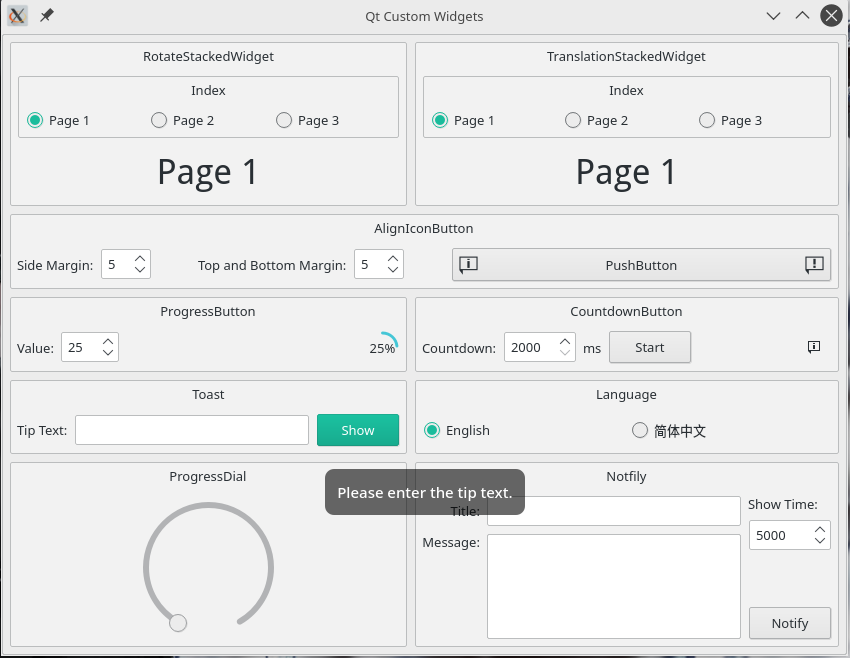
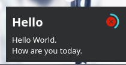

# CustomWidgetDemos



-------
## Class AlignIconButton
| File |
| ---- |
| [aligniconbutton.h](./src/customWidgets/aligniconbutton.h) |
| [aligniconbutton.cpp](./src/customWidgets/aligniconbutton.cpp) |
* 左右 icon 对齐 Push Button
* Example
    ```cpp
    AlignIconButton *pushButton = new AlignIconButton(this);
    pushButton->setLeftIcon(leftIcon);
    pushButton->setRightIcon(rightIcon);
    pushButton->show();
    ```
-----
## Class NotifyWidget & NotifyManager
| File |
| ---- |
| [notifywidget.h](./src/customWidgets/notifywidget.h) |
| [notifywidget.cpp](./src/customWidgets/notifywidget.cpp) |
| [notifymanager.h](./src/customWidgets/notifymanager.h) |
| [notifymanager.cpp](./src/customWidgets/notifymanager.cpp) |
* 桌面右下角弹窗
* Example
    ```cpp
    NotifyManager *manager = new NotifyManager(this);
    manager->notify(this, "Hello", "Hello World.\nHow are you today.");
    ```
-----
## Class ProgressButton
| File |
| ---- |
| [progressbutton.h](./src/customWidgets/progressbutton.h) |
| [progressbutton.cpp](./src/customWidgets/progressbutton.cpp) |
* 进度条按钮
* 提供了类似 `QProgressBar` 的API
* Example
    ```cpp
    ProgressButton *button = new ProgressButton(this);
    button->setValue(50);
    button->show();
    ```
-----
## Class RotateStackedWidget
| File |
| ---- |
| [rotatestackedwidget.h](./src/customWidgets/rotatestackedwidget.h) |
| [rotatestackedwidget.cpp](./src/customWidgets/rotatestackedwidget.cpp) |

* 带有翻转动画的 Stacked Widget
* Example
    ```cpp
    RotateStackedWidget *stackedWidget = new RotateStackedWidget(this);
    stackedWidget->addWidget(widget_1);
    stackedWidget->addWidget(widget_2);
    stackedWidget->setCurrentIndex(0);
    stackedWidget->rotate(1);           // 页面翻转
    ```
-----
## Class Toast
| File |
| ---- |
| [toast.h](./src/customWidgets/toast.h) |
| [toast.cpp](./src/customWidgets/toast.cpp) |

* Toast 提示窗

    注意：
    * 1.当 `parent == nullptr` 时，Toast会出现在活动桌面水平居中垂直 3/4 的地方，`parent != nullptr` 时则Toast会出现在父窗口水平居中垂直 3/4 的地方。
    * 2.当 Toast 正在显示的时候，重新调用时 `Toast::toast()` 将重新显示消息。
* Example
    ```cpp
    Toast *toast = new Toast(this);
    toast->toast("Hello");
    ```
-----
## Class TranslationStackedWidget
| File |
| ---- |
| [translationstackedwidget.h](./src/customWidgets/translationstackedwidget.h) |
| [translationstackedwidget.cpp](./src/customWidgets/translationstackedwidget.cpp) |

* 具有平移动画的 Stacked Widget
* Example
    ```cpp
    TranslationStackedWidget *stackedWidget = new TranslationStackedWidget(this);
    stackedWidget->addWidget(widget_1);
    stackedWidget->addWidget(widget_2);
    stackedWidget->setCurrentIndex(0);
    stackedWidget->moveToIndex(1);           // 页面平移
    ```