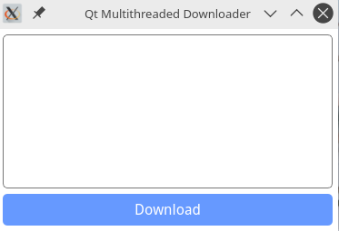
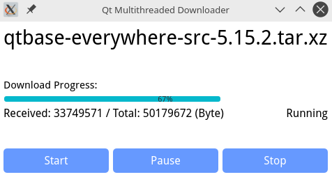

# MultithreadedDownloader
> *我想凭时间的有效利用去弥补匆匆流逝的光阴。*  
> *—— 蒙田《蒙田随笔》*




------
### 使用方法
* Qt Multithreaded Downloader Example
  ```
  Usage: MultithreadedDownloader [options]
  Qt Multithreaded Downloader Example.

  Options:
    -?, -h, --help                Displays help on commandline options.
    --help-all                    Displays help including Qt specific options.
    -u, --url <URL>               The URL to download.
    -t, --thread-number <number>  Set the thread number for download.
  ```
* Class MultithreadedDownloader
  * Add [src/downloader](./src/downloader) directory to your project.
  * `#include "multithreadeddownloader.h"`
  ```cpp
  MultithreadedDownloader *downloader = new MultithreadedDownloader(this);
  downloader->setUrl("https://mirrors.tuna.tsinghua.edu.cn/qt/official_releases/qt/5.15/5.15.2/submodules/qtbase-everywhere-src-5.15.2.zip");

  if(!downloader->load())
    return;                 // Failed to get resource.
  
  QDir::setCurrent("./");   // Set download path
  downloader->start();      // Start download
  ```
------
### 原理介绍
* 这是一个基于 `Qt5` 的多线程下载器。
* `Class AbstractMission` 是一个任务抽象类。
* `Class DownloadMission` 继承于 `AbstractMission` ，是一个下载任务类，它提供 `setRange()` 以用于分段下载，还实现了 `start()`，`pause()`，`stop()` 等任务控制函数。它的内部维护着一个 `QNetworkReply` 对象，当 `QNetworkReply::readyRead` 信号发射时，它会读出 reply 的缓冲区数据并调用 `MultithreadedDownloaderWriter::write()` 将一个写请求添加到处理队列。
* `Class MultithreadedDownloader` 继承于 `AbstractMission` ，管理着多个 `DownloadMission` 以实现文件分段并发下载，它也实现了 `start()`，`pause()`，`stop()` 等函数以控制多个 `DownloadMission`。分段下载（并发）数默认为 `QThread::idealThreadCount()` （CPU核心数）。它还管理着一个 `MultithreadedDownloaderWriter`。
* `Class MultithreadedDownloaderWriter` 继承于 `QThread` ，它负责文件写入，同时管理着写线程和下载的文件。
--------
*大概就这么多吧，不知道有没有人看，qwq。*